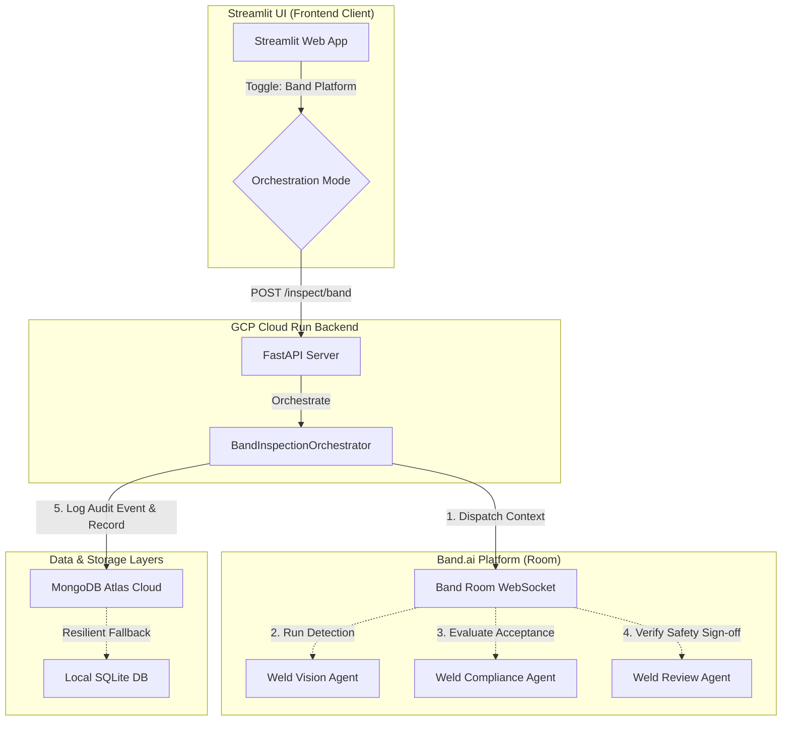
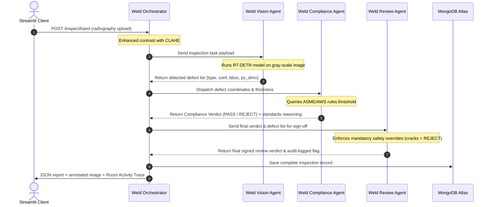

# AI Weld Inspector — Band.ai Multi-Agent Architecture

This document details the multi-agent orchestration architecture built using the **Band SDK** (`band-sdk[google_adk]`) and coordinated via the **Band of Agents** platform.

---

## 🏗️ System Architecture & Boundaries

The project integrates a **decoupled, event-driven multi-agent system** alongside our Hexagonal (Ports & Adapters) backend, allowing both local single-agent routing and distributed multi-agent collaboration rooms.

---

## 👥 The 4 Remote Agents

All agents run as remote, long-lived Python listeners utilizing the `band-sdk`. They connect via secure WebSockets to the Band platform (`wss://app.band.ai`).

| Agent Name | Role | Core Technologies |
| :--- | :--- | :--- |
| **Weld Orchestrator** | Hosts and manages the inspection room, dispatches contexts, and wraps up final verdicts. | Python, `band-sdk[google_adk]` |
| **Weld Vision** | Detects physical discontinuities and cracks from grey-scale radiography scans. | RT-DETR / YOLOv11x, OpenCV |
| **Weld Compliance** | Dynamically evaluates defect sizes against regulatory standard acceptance criteria (ASME/AWS/API). | Gemini 2.5 Flash, Rules Engine |
| **Weld Review** | Final safety auditor enforcing human-in-the-loop (HITL) overrides (e.g., crack = mandatory reject). | Gemini 2.5 Flash, MongoDB Adapter |

---

## 📈 Multi-Agent Message Sequence Flow

Below is the message coordination sequence within the Band room during an inspection request:

---

## 💾 Failover & Resiliency Principles
- **Vision Caching**: Cryptographic SHA-256 hashes of radiography scans are indexed. If an identical scan is re-submitted, the system returns cached detection bboxes, skipping redundant inference overhead.
- **Failover Databases**: If connection to the cloud MongoDB Atlas instance drops, the core domain automatically routes storage and audit events to a local SQLite fallback database (`data/local_ndt.db`), synchronizing when the connection recovers.
