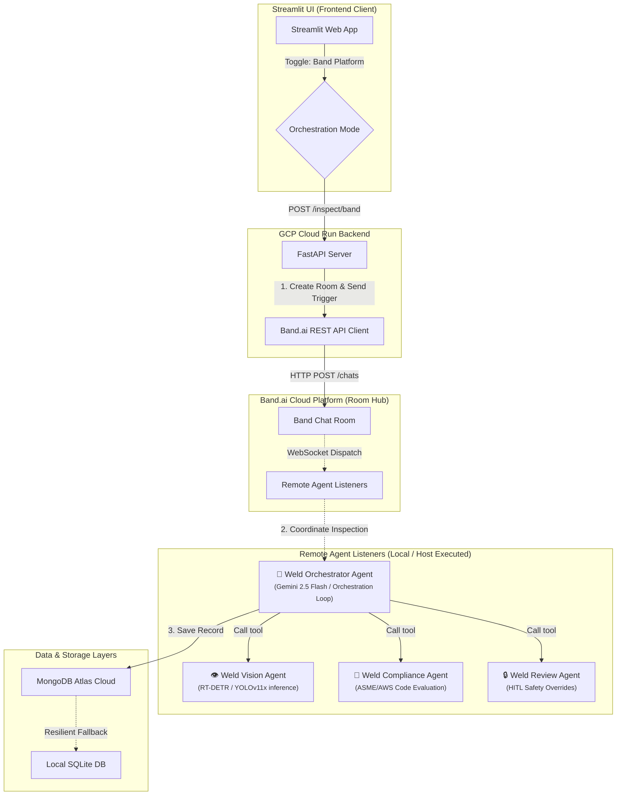
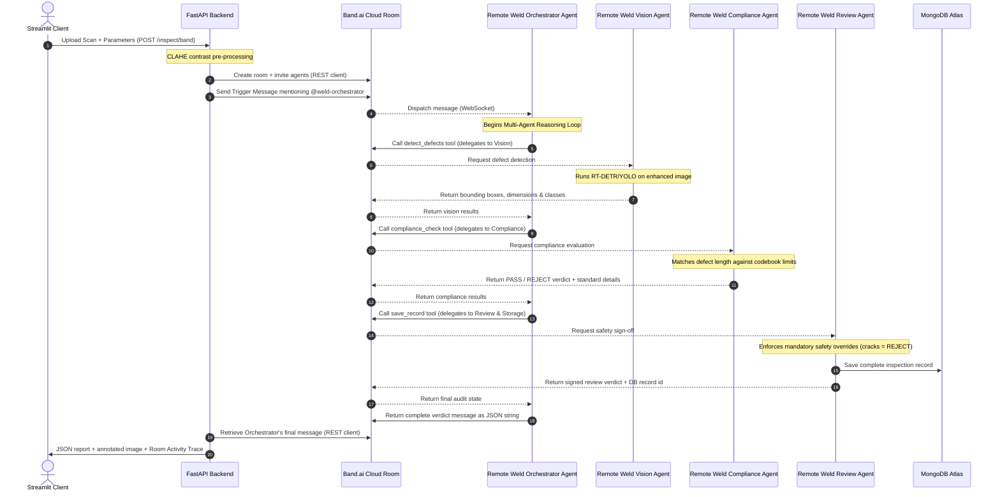

# AI Weld Inspector — Band.ai Multi-Agent Architecture

This document details the multi-agent orchestration architecture built using the **Band SDK** (`band-sdk[google_adk]`) and coordinated natively via the **Band of Agents** platform.

---

## 🏗️ System Architecture & Boundaries

The system leverages the **Band.ai Cloud Platform** to coordinate tasks between 4 decoupled, remote agent daemons. Instead of executing local in-process calls, the API dispatch creates a secure room, invites the remote agent listeners, and uses real-time WebSockets to coordinate the inspection.

---

## 👥 The 4 Remote Agents (Highlighted)

All agents run as remote, long-lived Python listeners utilizing the `band-sdk`. They connect via secure WebSockets to the Band platform (`wss://app.band.ai`).

| Agent Name | Role | Core Technologies | Band ID (UUID) |
| :--- | :--- | :--- | :--- |
| **Weld Orchestrator** | Coordinates the full inspection room, manages intermediate task states, dispatches tool inputs, and returns the final structured verdicts. | Python, `band-sdk[google_adk]`, Gemini 2.5 Flash | `b0c1269c-4d84-4e4a-806c-9941ab848986` |
| **Weld Vision** | Detects physical weld defects (porosity, cracks, undercuts) directly from radiography scans. | RT-DETR / YOLOv11x, OpenCV, `band-sdk` | `f89e3592-fc66-4c3d-8ccc-d052ae5c0ccd` |
| **Weld Compliance** | Evaluates defect coordinates and dimensions against safety codebooks (ASME/AWS/API). | Python rules engine, Gemini 2.5 Flash, `band-sdk` | `b65bb3b0-5e8e-4466-8a5c-7c406402505f` |
| **Weld Review** | Final gatekeeper applying safety-critical overrides (rejecting cracks) and saving the verified audit trail. | MongoDB Adapter, Gemini 2.5 Flash, `band-sdk` | `027c7f2f-cd79-4450-990d-8f6b2d2e4b12` |

---

## 📈 Multi-Agent Message Sequence Flow (Band.ai Platform)

Below is the message coordination sequence executed natively through the Band.ai room during a scan inspection:

---

## 💾 Failover & Resiliency Principles
- **Band Connection Fallback**: If the backend cannot communicate with the Band.ai platform, or if the remote agent WebSocket listeners are offline, the backend automatically defaults to local in-process execution to ensure uninterrupted quality control in the field.
- **Vision Caching**: Cryptographic SHA-256 hashes of radiography scans are indexed. If an identical scan is re-submitted, the system returns cached detection bboxes, skipping redundant inference overhead.
- **Failover Databases**: If connection to the cloud MongoDB Atlas instance drops, the core domain automatically routes storage and audit events to a local SQLite fallback database (`data/local_ndt.db`), synchronizing when the connection recovers.
