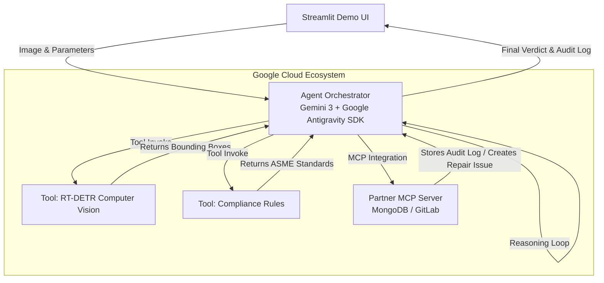

# Dual Hackathon Project Philosophy

This project is a unified submission for two concurrent AI hackathons, strategically designed to meet the strict criteria of both by using a modular, agentic architecture. 

It serves as the baseline project before being later morphed onto the Band platform (for the AMD Band of Agents hackathon).

## Unified Architecture

## Hackathon 1: Google for Startups AI Agents Challenge
**Track 1: Build (Net-New Agents)**

### Checklist & Criteria Fulfillment
- [x] **Startup Eligibility:** Built by a registered startup.
- [x] **Net-New Agent:** Transitioned static CV code to a fully autonomous generative AI system.
- [x] **Framework:** Uses Google Antigravity SDK (Agent Development Kit).
- [x] **Architecture Diagram:** Provided in README and Project Philosophy.
- [x] **Business Case:** Solves a critical bottleneck in Non-Destructive Testing (NDT) for Oil & Gas by bridging probabilistic CV with deterministic ASME engineering rules.

## Hackathon 2: Google Cloud Rapid Agent Hackathon
**Track: Partner Integration**

### Checklist & Criteria Fulfillment
- [x] **Google Cloud Agent Builder / Gemini 3:** Orchestrated using Gemini 3 and Google's agentic ecosystem tools.
- [x] **Partner MCP Server Integration:** The agent autonomously connects to a Partner MCP Server. For this project, we are targeting **MongoDB** to permanently log the inspection results for compliance auditing, and optionally **GitLab** to automatically create a maintenance issue when a defect is found.
- [x] **Multi-Step Mission:** The agent performs multi-step reasoning: (1) analyze image via CV tool, (2) read compliance rules, (3) calculate pass/fail, (4) log result via MCP.
- [x] **Open Source Public Repository:** The codebase is public with an open-source license.
- [x] **Real-World Challenge:** Automates the "Review-to-Repair" pipeline for safety-critical infrastructure.
