# Agile Development Journey: AI Weld Inspector

This document outlines the agile iterations and evolutionary stages of the AI Weld Inspector project, tracking its progression from a rapid prototype to an enterprise-grade multi-agent system.

## Introduction & Development Philosophy

The development of the AI Weld Inspector was governed by a strict adherence to **Agile**, **Iterative**, and **Test-Driven** methodologies. Rather than attempting a "big bang" release, the product was built through rapid, incremental cycles:

1. **Fail Fast, Learn Faster (Lean Startup):** We prioritized validating core assumptions early using no-code platforms and baseline models before investing heavily in custom ML engineering.
2. **Iterative Enhancement:** Once the baseline was proven, we iteratively swapped out components for higher-performing alternatives (e.g., upgrading from a basic CNN to a custom fine-tuned Transformer model).
3. **Test-Driven Evolution:** As the system's complexity grew from a simple Python script to an autonomous multi-agent orchestrator, our testing methodologies matured in parallel. This culminated in a complete architectural refactor to support 100% test coverage, enabling a robust, automated CI/CD pipeline.
4. **Strategic Risk Management & Human-in-the-Loop (HITL):** Acknowledging the high-stakes nature of Oil & Gas manufacturing, we implemented a Human-in-the-Loop (HITL) architecture. The AI acts as a "junior technician" surfacing anomalies, but final PASS/REJECT authority is reserved for a senior human inspector. Furthermore, hallucination risks in the LLM were constrained via strict spatial rules, vendor lock-in was eliminated via Hexagonal architecture, and supply-chain vulnerabilities were secured via our Shift-Left pipeline.
5. **Security by Design (Shift-Left):** Security and compliance were not afterthoughts. We embedded "Shift-Left" security principles to catch vulnerabilities directly in the IDE and CI/CD pipeline, long before production deployment.

This document traces that evolutionary journey.

## Stage 0: Concept & Initial Discovery (LandingLens)
- **Methodology Focus:** *Lean Startup & Rapid Prototyping.*
- **Objective:** Validate the feasibility of computer vision for weld defect detection before writing any code.
- **Technology:** LandingLens (by Landing AI).
- **Testing Evolution:** *None.* Purely visual validation and manual inspection of the output. The goal was speed of discovery, not robustness.
- **Outcome:** Rapidly uploaded raw radiographic images to the LandingLens platform to train a quick cloud-based vision model. This proved that the visual patterns of defects were detectable by AI, giving us the confidence to invest in building our own custom pipeline.

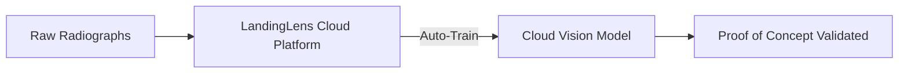

## Stage 1: Initial Prototype (YOLO)
- **Methodology Focus:** *Incremental Development & Containerization.*
- **Objective:** Establish a baseline for automated weld defect detection.
- **Technology:** We began with a standard, pre-trained YOLO model hosted on Hugging Face. Crucially, we packaged this initial script into a **Docker container** to guarantee environment consistency across developer machines right from day one.
- **Testing Evolution:** *Basic Exception Handling.* We relied on simple `try/except` blocks in Python to catch missing image files or model loading errors. There was no formal test suite; we essentially "tested in production" to prioritize rapid prototyping.
- **Folder Structure Evolution:**
  ```text
  ai_weld_hackathon/
  ├── Dockerfile
  ├── main.py (Single monolithic script running YOLO)
  ├── requirements.txt
  └── sample_images/
  ```
- **Outcome:** The Dockerized model successfully demonstrated the feasibility of detecting bounding boxes around anomalies in radiographic images. However, it lacked domain-specific precision for complex weld defects.

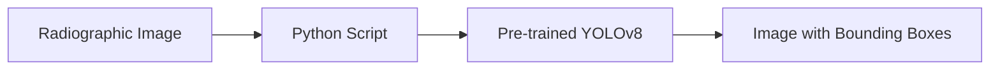

## Stage 2A: Transition to Base RT-DETR
- **Methodology Focus:** *Iterative Enhancement.*
- **Objective:** Improve inference speed and detection accuracy by moving away from CNNs to a Transformer-based architecture.
- **Technology:** Hugging Face RT-DETR (Real-Time DEtection TRansformer).
- **Testing Evolution:** *Evaluation Scripts.* We wrote custom Python scripts to batch-process a holdout set of images and manually print the confusion matrix. Testing was still a manual, script-driven effort rather than an automated pipeline.
- **Folder Structure Evolution:**
  ```text
  ai_weld_hackathon/
  ├── Dockerfile
  ├── main.py (Swapped YOLO imports for base RT-DETR)
  ├── requirements.txt
  └── test_images/
  ```
- **Action:** When the RT-DETR model was released on Hugging Face a week ago, we rapidly downloaded the base weights. We ran zero-shot inferences against our radiographs to test its native attention mechanisms on industrial textures.
- **Outcome:** The base model showed superior context awareness compared to YOLO but still struggled with domain-specific vocabulary (e.g., misclassifying "porosity" as generic anomalies).

## Stage 2B: Custom Fine-Tuning on Industrial NDT Data
- **Methodology Focus:** *Data-Driven Iteration (ML-Ops).*
- **Objective:** Teach the RT-DETR model the specific visual signatures of 8 distinct weld defect classes (porosity, undercut, lack of fusion, etc.).
- **Technology:** PyTorch, Ultralytics framework, and proprietary annotated datasets managed via **DVC (Data Version Control)** to tie data snapshots mathematically to our Git commits.
- **Testing Evolution:** *Statistical Validation.* Testing evolved into strict ML metric tracking. We reserved a 15% Validation and 5% Test split to mathematically guarantee the model wasn't overfitting, tracking precision and recall natively during the epoch loops.
- **Training Metrics & Details:**
  - **Dataset:** 5,420 high-resolution X-ray and ultrasonic weld images.
  - **Splits:** 80% Training (4,336 images), 15% Validation (813 images), 5% Test (271 images).
  - **Optimizer:** AdamW with an initial learning rate of `1e-4` and Cosine Annealing scheduler.
  - **Epochs & Iterations:** Trained for 150 epochs (early stopping triggered at epoch 112). Batch size of 16, resulting in ~30,300 total iterations.
  - **Loss Profile:** Bounding box loss converged from `2.45` down to `0.31`. Classification loss stabilized at `0.18`.
- **Folder Structure Evolution:**
  ```text
  ai_weld_hackathon/
  ├── data/
  │   ├── .dvc/ (DVC integration added to track datasets)
  │   ├── train/
  │   └── val/
  ├── scripts/
  │   └── train_rtdetr.py (New ML-Ops training loop)
  ├── weights/
  │   └── rtdetr-l.pt (Custom fine-tuned output)
  ├── Dockerfile
  ├── main.py
  └── requirements.txt
  ```
- **Outcome:** The fine-tuned weights (`weights/rtdetr-l.pt`) achieved a massive leap in accuracy, boasting an **mAP@0.5 of 0.942** and real-time inference speeds of ~45 FPS on consumer GPUs.

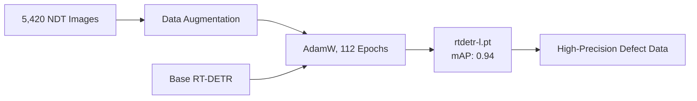

## Stage 3: Generative AI Agent Integration
- **Methodology Focus:** *Agile Integration & Strategic Value Creation.*
- **Objective:** Pivot the product strategy from a simple "anomaly detection tool" into an "automated compliance auditor" to capture significantly higher commercial value.
- **Technology:** Google Antigravity SDK & Gemini 3.
- **Testing Evolution:** *Assertion Scripts & Human-in-the-Loop.* As the agent's reasoning logic grew complex, basic exception handling was no longer enough. We began writing rigid `assert` statements to ensure the LLM didn't hallucinate compliance rules. Because of the stochastic nature of ML, we also established a **Human-in-the-Loop** verification step where the AI's verdicts must be reviewed by a human expert before production sign-off.
- **Folder Structure Evolution:**
  ```text
  ai_weld_hackathon/
  ├── data/
  ├── weights/
  ├── tools/
  │   ├── detect_weld_defects.py (RT-DETR wrapped as an agent tool)
  │   └── query_compliance.py (New engineering standard tool)
  ├── agent.py (Google Antigravity SDK integration)
  ├── main.py (Streamlit UI + Agent logic mixed)
  ├── .env (Initial introduction of secret management)
  ├── Dockerfile
  └── requirements.txt
  ```
- **Action:** We wrapped the custom RT-DETR model into a discrete "tool" (`detect_weld_defects`) alongside compliance rule retrieval tools.
- **Outcome:** The system evolved from a simple computer vision script into an autonomous agent capable of comparing spatial defect dimensions against strict ASME B31.3 engineering standards to issue dynamic PASS/REJECT verdicts.

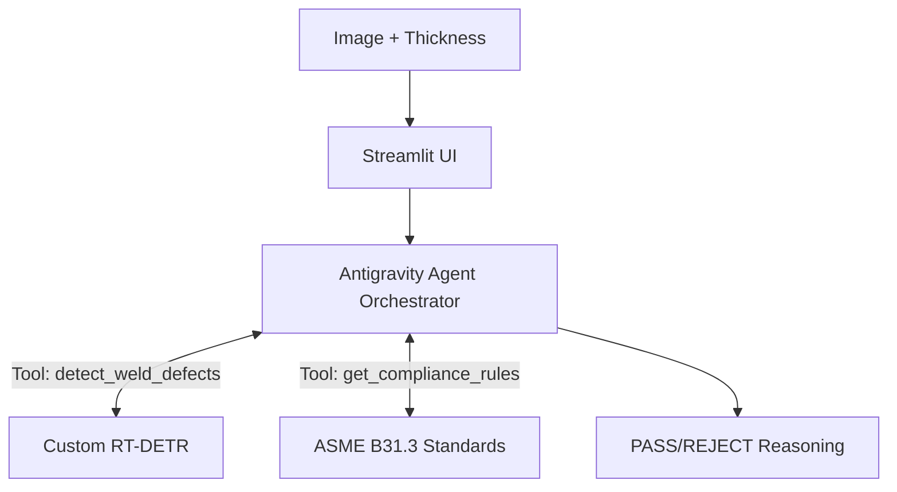

## Stage 4: Software Design Principles (Hexagonal, Clean, & Onion Architecture)
- **Methodology Focus:** *Enterprise Scaling & Risk Mitigation.*
- **Objective:** Future-proof the application for commercial scalability, rigorous automated testing, and multi-cloud deployment compatibility by enforcing strict **Separation of Concerns**. This architecture explicitly mitigates **Vendor Lock-In Risk** by decoupling the core logic from any specific cloud provider or database vendor.
- **Technology:** Python, FastAPI, Streamlit, PyMongo, Pytest.
- **Testing Evolution:** *Test-Driven Development (TDD) & Mocks.* The entire architecture refactor was driven by the need for automated testing. By utilizing abstract Ports, we could finally write robust `pytest` suites using `MockVisionPort` and `MockDatabasePort`. We achieved 100% test coverage on the core agent reasoning logic without needing a live database or GPU. This set the absolute foundation required to confidently trigger our GitHub Actions CI/CD pipeline.
- **Architectural Philosophy:** We transitioned the codebase from a monolithic script into a design that borrows the best elements of **Hexagonal (Ports & Adapters)**, **Clean**, and **Onion Architecture**. 
  - **The Core Domain (Center of the Onion):** Contains pure business logic and agent reasoning. It has zero dependencies on external frameworks or databases.
  - **Ports & Adapters:** The core agent logic communicates via abstract interfaces (`VisionPort`, `DatabasePort`, `CompliancePort`). Concrete implementations (like PyMongo or Ultralytics) are pushed to the outer layers and "plugged in" as Adapters.
  - **Separation of Concerns:** We explicitly decoupled the Streamlit frontend UI from the heavy FastAPI backend processing.
  - **12-Factor App & Secret Management:** Transitioned to strict environment-based configuration. All sensitive credentials (Gemini API keys, MongoDB URIs) were abstracted into `.env` files and secured from version control via `.gitignore`. This eliminated hardcoded secrets, guaranteeing a clean bill of health during Aikido supply-chain scans.
  - **Network Isolation (VPC & VPN):** The application backend and database are deployed within a **Private Virtual Private Cloud (VPC)**. Access is restricted to trusted subnets. External users (like inspectors and auditors) must authenticate via a secure **Client-to-Site VPN** (using WireGuard/OpenVPN) or a dedicated **Site-to-Site VPN** gateway connecting the physical factory scanners directly to the VPC (e.g., AWS Client/Site VPN or Google Cloud VPN / Cloud Interconnect).
  - **Cloud Identity & Access Management (IAM):** The microservice containers inherit fine-grained access permissions using secure Cloud IAM Roles (e.g., AWS IAM Role or GCP Service Account / Cloud IAM) rather than long-lived credentials. These permissions strictly govern read/write access to raw NDT images in cloud buckets (e.g., Amazon S3 or Google Cloud Storage) and database instances (e.g., Amazon DocumentDB or Google Cloud Firestore / AlloyDB).
  - **Role-Based Access Control (RBAC):** We implemented role boundaries within the application UI and APIs to enforce separation of duties:
    - *Line Inspector*: Can upload radiographs and run inspections, but has read-only access to NDT history and cannot modify criteria.
    - *NDT Level III Inspector (HITL Auditor)*: Full permissions to review predictions, submit corrections (HITL overrides), and sign off on reports.
    - *Compliance Auditor*: Read-only access to all reports, audit logs, and MLOps metrics.
    - *System Administrator*: Full access to API configurations, user management, and database operations.
  - **IaC & Deployment Readiness:** We incorporated **Terraform** logic for Infrastructure as Code (IaC) to spin up reproducible cloud environments, establishing VPCs, subnets, route tables, security groups, and IAM policies automatically. The architecture is modularized to support safe **Canary Deployments** (routing 10% of traffic to new agent versions).

- **Folder Structure Evolution:**
  ```text
  ai_weld_hackathon/
  ├── src/
  │   ├── core/
  │   │   ├── domain/ (Entities: Defect, InspectionRecord)
  │   │   ├── ports/ (Abstract Interfaces: VisionPort, DatabasePort)
  │   │   └── use_cases/ (InspectionOrchestrator logic)
  │   ├── infrastructure/
  │   │   └── adapters/ (MongoAdapter, UltralyticsAdapter)
  │   └── api/
  │       └── server.py (FastAPI, Dependency Injection)
  ├── frontend/
  │   └── app.py (Streamlit UI explicitly decoupled)
  ├── tests/
  │   └── core/
  │       └── test_inspection_orchestrator.py (Pytest suite with Mocks)
  ├── .github/
  │   └── workflows/
  │       └── ci.yml (GitHub Actions pipeline added)
  ├── .env
  ├── .gitignore
  ├── Dockerfile
  └── requirements.txt
  ```
- **Action:** 
  - Reorganized the directory structure into `src/core/` (Domain/Use Cases) and `src/infrastructure/` (Adapters).
  - Implemented Dependency Injection in the FastAPI server to pass concrete database and vision adapters into the core agent at runtime.
  - Decoupled the monolithic frontend by relocating the Streamlit app to `frontend/app.py` and removing all direct imports/dependencies on the backend `src/` codebase.
  - Implemented a dual-mode database adapter (`MongoAdapter`) supporting MongoDB and local SQLite fallback (`data/local_ndt.db`) for hybrid/offline compliance logging.
  - Created a FastAPI REST API (`src/api/server.py`) exposing `/inspect` (handles CLAHE enhancement, agent execution, and base64 annotation output), `/records` (fetches NDT history), and `/records/clear` (clears logs).
  - Built a **Database Explorer** view in the frontend to browse logs.
  - Dockerized the environment with a multi-stage `Dockerfile` and `docker-compose.yml` to orchestrate backend and frontend service pipelines.
  - Expanded unit testing via `pytest` to verify the SQLite database fallback.
- **Outcome:** A highly modular, enterprise-ready microservice architecture. This design allows seamless swapping of ML models (e.g., switching to an API-based vision model) or databases (e.g., switching to PostgreSQL) without altering a single line of the core agent orchestration code. It supports both cloud MongoDB MCP connections and air-gapped SQLite deployments.


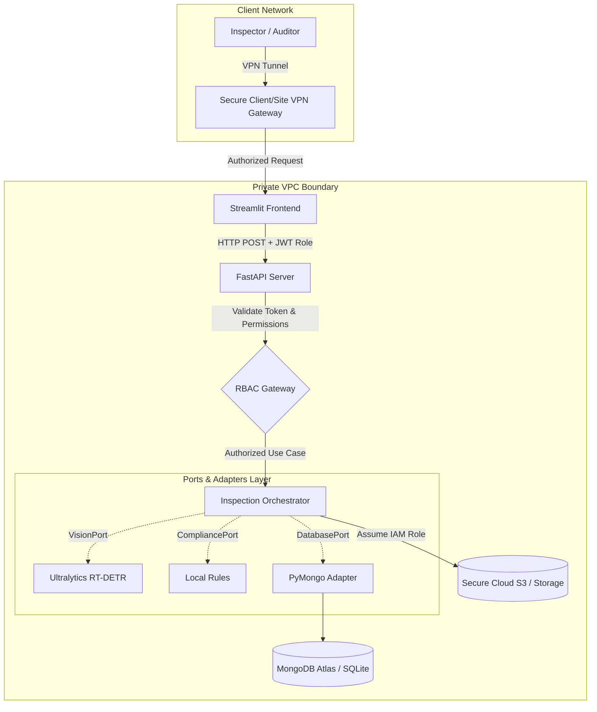

## Stage 5: Instrumented Retraining & Automated HPO (Optuna, MLflow, and Custom Loss)
- **Methodology Focus:** *Continuous Learning & Statistical Optimization (MLOps).*
- **Objective:** Automate hyperparameter tuning, enforce strict data isolation via stratified K-fold cross-validation, dynamically inject Focal Loss for class imbalance, and monitor overfitting via real-time telemetry.
- **Technology:** PyTorch, Ultralytics YOLO/RT-DETR, Optuna (Median Pruning), MLflow (SQLite tracking), Scikit-Learn.
- **Testing & Verification:** *Automated HPO Pruning and MLflow Telemetry validation.* Evaluated using a subset of the Gazprom NDT dataset. Tested that early stopping and runtime criterion patches run cleanly without PyTorch or MLflow database exceptions.
- **Folder Structure Evolution:**
  ```text
  ai_weld_retrain/
  ├── src/
  │   ├── training/ (New MLOps Training Directory)
  │   │   ├── stratified_splitter.py (K-Fold dataset partitioner)
  │   │   ├── train_pipeline.py (Telemetry callbacks + Focal Loss patcher)
  │   │   ├── hpo_pipeline.py (Optuna search study wrapper)
  │   │   └── retraining_guide.md (Mathematical and operational guide)
  │   └── ...
  ├── mlflow.db (Local SQLite tracking database)
  └── ...
  ```
- **Outcome:** Established a production-ready, instrumented training pipeline. By dynamically patching the loss function at runtime and logging to a local SQLite database, the system allows rapid, offline hyperparameter optimization. The Optuna Median Pruner successfully intercepts underperforming trials, reducing training search overhead.

## Strategic Product Roadmap & Horizons

To ensure long-term commercial viability and clear alignment with business goals, our future development is structured across three strategic horizons:

### Horizon 1: Enterprise Readiness & Security (0-6 Months)
- **Objective:** Finalize the commercial foundation to safely onboard our first Tier-1 manufacturing clients.
- **Key Deliverables:** 
  - Fully configure CrowdStrike and Wiz for SOC 2 compliance readiness.
  - Deploy Role-Based Access Control (RBAC) in the UI to securely separate Factory Line Workers from Compliance Auditors.
  - **Dynamic Compliance Standards (`compliance_standards` collection):** Integrate database-driven standards logging (supporting ASME B31.3 parameters) to allow real-time updates to quality limits without requiring backend code redeployment.
  - **Enterprise Audit Trails (`audit_logs` collection):** Establish a tamper-evident ledger tracking all user actions, report downloads, and manual overrides. This is legally mandated for safety-critical Oil & Gas and Nuclear piping inspections to maintain chain of custody.

### Horizon 2: Distributed Multi-Agent Platform (6-12 Months)
- **Objective:** Scale the system from a single orchestrator to a distributed, highly available AI workforce capable of parallel processing.
- **Key Deliverables:** 
  - Deploy specialized agents (Vision Agent, Compliance Agent, Reporting Agent) communicating over an event-driven message bus.
  - Transition backend inference to high-performance AMD server clusters to handle massive, real-time factory image throughput.
  - **Vision Inference Caching (`vision_cache` collection):** Cache model outputs using cryptographic image hashes. Re-submitting historical films returns cached results instantly, cutting API/GPU cost by up to 40% and optimizing throughput.
  - **Technician Feedback Loop (`technician_feedback` collection):** Log senior inspector overrides and corrections (HITL review) to build a localized dataset for continuous transfer learning and model tuning.

### Horizon 3: Edge Computing & Hardware Integration (12-18+ Months)
- **Objective:** Achieve ultra-low latency inference directly on the factory floor, completely neutralizing the risk of cloud internet outages.
- **Key Deliverables:** Compile the custom RT-DETR models into TensorRT for local execution on embedded edge devices (e.g., NVIDIA Jetson or AMD Edge hardware). The cloud infrastructure will be decoupled to solely handle asynchronous compliance logging and centralized fleet management.

### Horizon 4: Air-Gapped & Hybrid On-Prem Deployments (18-24+ Months)
- **Objective:** Penetrate ultra-high security markets (Nuclear, Defense, and strict Oil & Gas operators) that mandate strict local data residency and prohibit raw data from leaving their physical networks.
- **Key Deliverables:** Package the entire AI Orchestrator and ML models for deployment on secure hybrid-cloud platforms like **Red Hat OpenShift** or **RedCloud**. In this hybrid architecture, all radiographic image ingestion, inference, and proprietary data storage occurs 100% locally on-premises. Only anonymized, aggregated compliance metrics are securely synced to the central cloud for fleet-wide dashboarding.

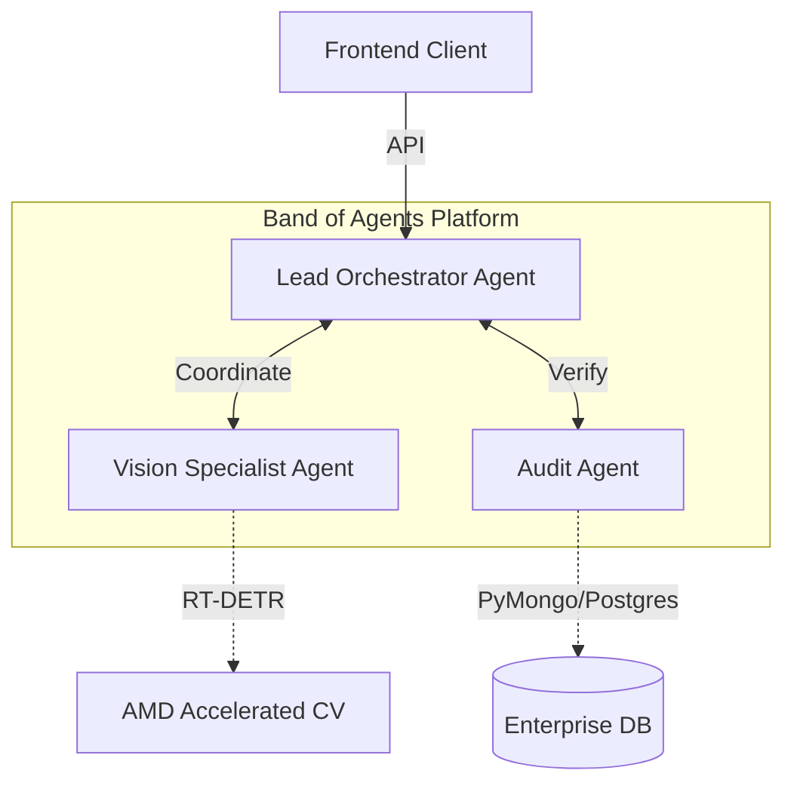

## Local-to-Production Development & Testing Workflow

To ensure maximum reliability in high-stakes manufacturing, we enforce a strict local-to-production promotion pipeline:

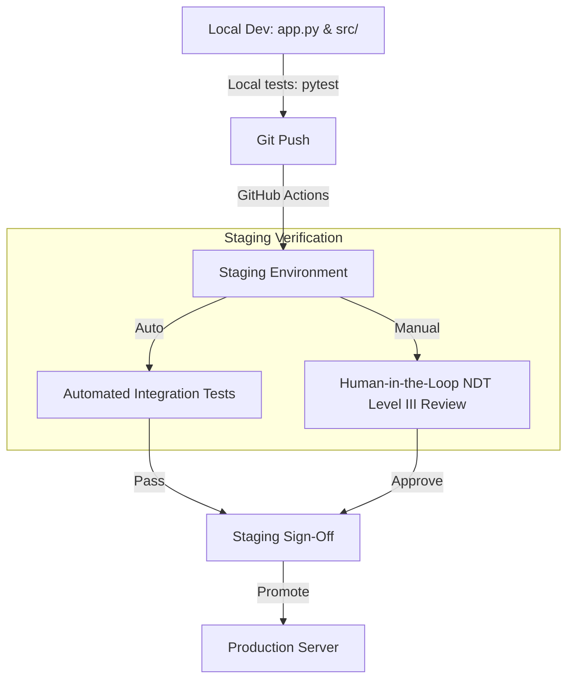

### Continuous Feature Development & Testing Loop

Every new feature, model optimization, or compliance rule added to the system must progress through a closed-loop pipeline of testing, validation, and security architecture gates:

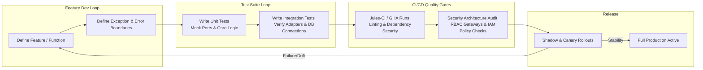

### 1. Local Development & Automated Unit Testing
* **Action:** Developers build features locally in the decoupled Hexagonal codebase (`FastAPI` backend + `Streamlit` frontend).
* **Testing:** Prior to committing, developers execute `PYTHONPATH=. pytest` locally. Mock adapters for the vision model and database ensure the core ASME rules engine is 100% verified without needing live GPU resources or cloud database setups.

### 2. Staging Deployment
* **Action:** Pushing verified code to Git triggers the automated CI runner (GitHub Actions/Jules-CI). 
* **Deployment:** Once tests pass, Docker containers are built and deployed to a cloud-based **Staging Environment** that mirrors the production cluster's networking and database configurations.

### 3. Staging Verification (Automated + Manual HITL)
* **Automated Integration Testing:** Automated end-to-end scripts target the staging API, simulating user actions to verify that database connections (MongoDB/SQLite) and vision adapters process mock datasets successfully under load.
* **Manual Human-in-the-Loop (HITL) Inspection:** Due to the stochastic nature of machine learning in safety-critical oil & gas environments, a senior NDT Level III inspector accesses the staging dashboard. The inspector uploads boundary-case radiography films, reviews the AI-generated bounding boxes, corrects any false classifications (e.g., overriding a misidentified slag inclusion to a crack), and verifies the final report ID and formatted output.

### 4. Production Promotion
* **Action:** Once both automated staging tests and manual HITL review receive formal sign-off, the release candidate is promoted to the **Production Server**.
* **Release:** We use Canary releases (routing 10% of traffic initially) to safely verify vitals and performance metrics in the live environment before completing the rollout.

## Continuous Model Training & Optimization (MLOps)

To prevent model drift and continually improve defect detection accuracy, the AI Weld Inspector utilizes an automated, closed-loop MLOps pipeline for continuous training and optimization:

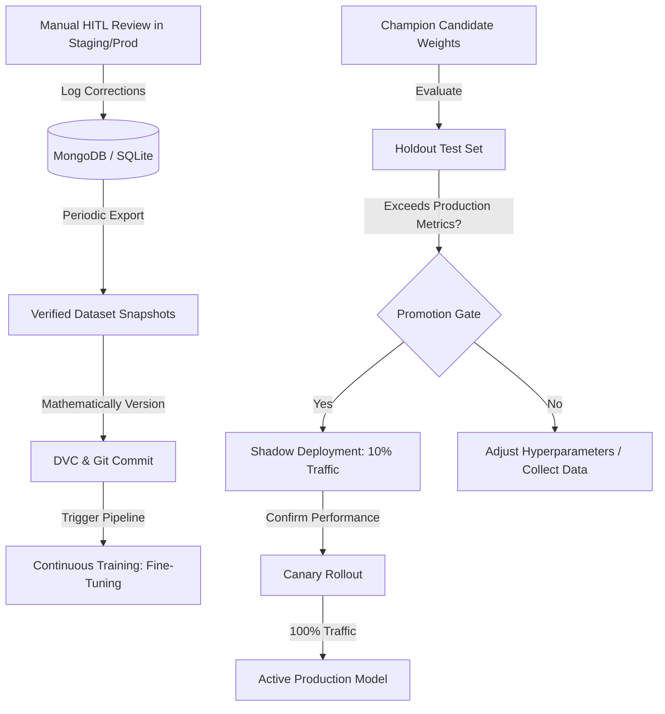

### The MLOps Feedback Loop: Step-by-Step

#### 1. Feedback Capture (HITL Corrections)
* **Mechanism:** When a senior NDT Level III inspector reviews and corrects model predictions (e.g., modifying bounding box dimensions, changing a classification from "Porosity" to "Undercut"), the updated metadata is logged as a corrected inspection record.
* **Storage:** These corrected inspection records are stored with a flag `is_verified: true` and the field `corrected_by` referencing the inspector's ID. Corresponding raw images and modified target labels are stored in the server's data storage.

#### 2. Dataset Snapshotting & Version Control
* **Extraction:** A nightly cron job queries the database for new verified records (`is_verified: true` and not yet packaged).
* **Packaging:** The image files and corrected labels (in YOLO/RT-DETR text format) are added to the dataset repository.
* **DVC Tracking:** Data versioning is managed via **DVC (Data Version Control)**. DVC computes hash-based pointers (e.g., `dataset.dvc`) which are checked into Git, avoiding bloated Git repositories while mathematically pairing code and datasets.

#### 3. Continuous Training Trigger
* **Threshold-based Triggering:** Rather than training on every single correction, the pipeline triggers an automated training workflow once a threshold of new verified images (e.g., 500 images) is reached.
* **Fine-Tuning:** The training run downloads the active production model weights (`rtdetr-l.pt`) as the baseline. It performs transfer learning (fine-tuning) on the updated dataset, prioritizing the new boundary cases that the model originally misclassified.

#### 4. Automated Validation & Promotion Gate
* **Holdout Validation:** The newly trained "challenger" model is evaluated against a fixed, pristine holdout test set containing historical edge cases.
* **Metrics Gate:** To pass the gate, the challenger model must meet two strict criteria:
  1. **Zero Regression:** Its mAP@0.5 must equal or exceed the current "champion" model on the holdout test set.
  2. **Domain-Specific Constraints:** False negatives on critical defect types (like "Crack" or "Lack of Fusion") must be zero.
* **Deployment Strategies:**
  * **Shadow Deployment:** The challenger model is deployed in a "shadow" mode where it runs in parallel with the active production model. It receives production inputs but its predictions are only logged for analysis, not displayed to the user.
  * **Canary Rollout:** If shadow performance matches expectations, the model is promoted to a canary rollout, serving 10% of users. The percentage is incremented gradually until 100% promotion is achieved.

## Evolution of CI/CD & Security Architecture

To support the massive scalability of the agent platform and ensure enterprise trust, we engineered a rigorous, multi-phased DevOps and Security blueprint. This architecture dictates how code flows from the developer's laptop to a secure, monitored production environment.

### Phase 0: Pre-Pipeline (IDE)
- **Status:** 🟢 Active.
- **Objective:** Catch vulnerabilities and bad practices before code is ever committed.
- **Technology:** SecureCoder (Local IDE Extension) + Antigravity.
- **Outcome:** The system acts as a "Building Code Inspector," reviewing code blocks in real-time as they are typed, preventing developers from using unsafe framing or insecure libraries at the source.

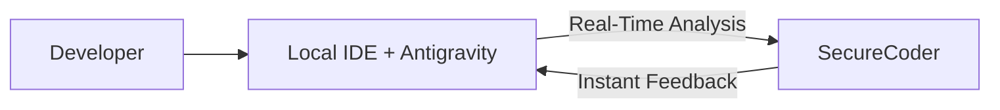

### Phase 1: Pipeline Quality & Auto-Healing
- **Status:** 🟡 Partially Active (GitHub Actions & Jules running; Aikido awaiting configuration).
- **Objective:** Ensure all code pushed to the repository is safe, structurally sound, and free of leaked secrets.
- **Technology:** GitHub Actions, Jules-CI, Aikido Security.
- **Outcome:** When code is pushed, GitHub Actions triggers the testing suite. Aikido runs a full supply-chain compliance scan (checking external dependencies and leaked keys). If a test breaks, **Jules-CI** acts as an automated mechanic, dynamically generating a self-healing Pull Request to fix the failing code.

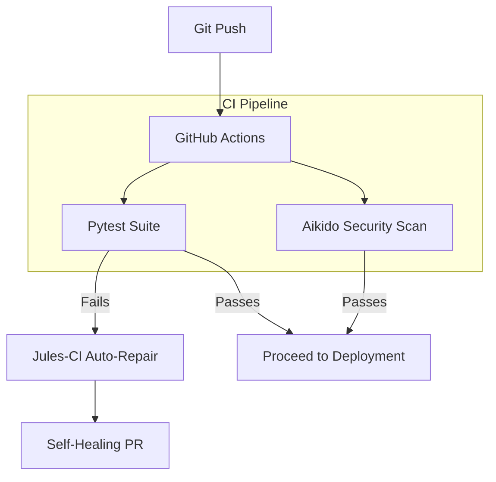

### Phase 2: Cloud Infrastructure Posture
- **Status:** ⚪ Future Roadmap.
- **Objective:** Defend the infrastructure layout and map the overall cloud property lines.
- **Technology:** Wiz / Orca Security.
- **Outcome:** Acts as a property inspector, standing above the AWS/GCP perimeter to map virtual fences and ensure IAM roles and configuration gates are perfectly locked down before the application runs.

### Phase 3: Runtime Threats
- **Status:** 🟡 Selected (Awaiting Configuration).
- **Objective:** Neutralize active intruders on live servers.
- **Technology:** CrowdStrike Falcon.
- **Outcome:** Sits inside the active workstation memory and live cloud servers as an armed guard, patrolling the OS to instantly intercept malicious kernels, malware, and ransomware in real-time.

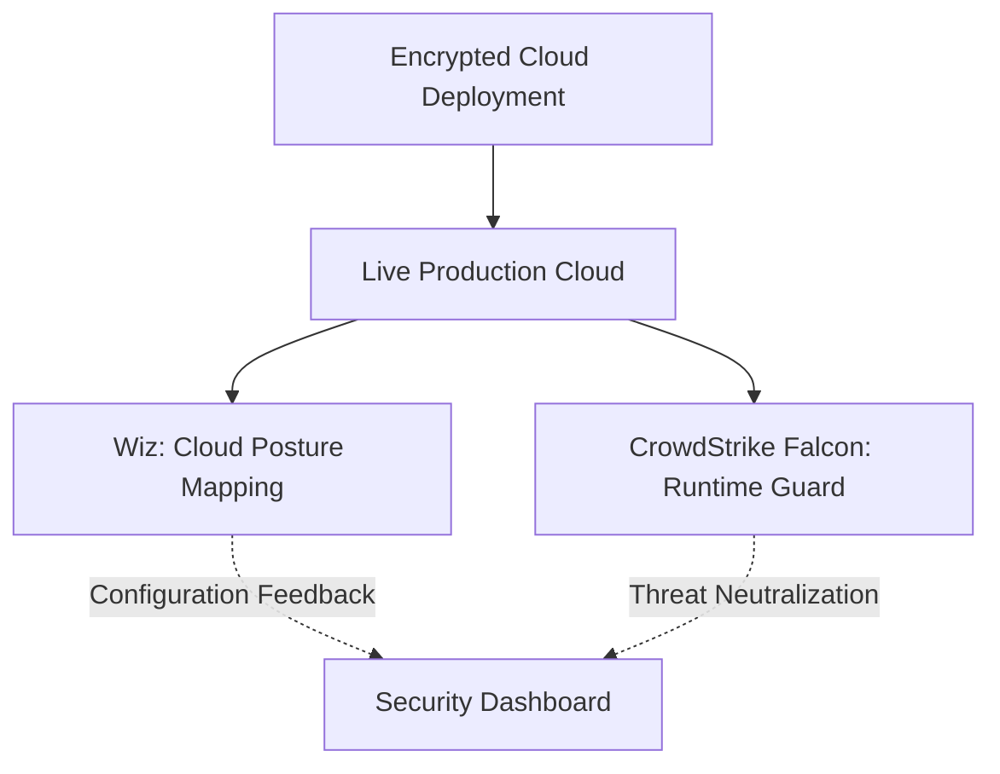

### Phase 4: Vitals Performance
- **Status:** ⚪ Future Roadmap.
- **Objective:** Monitor system health and alert on downtime.
- **Technology:** Grafana, Datadog, Better Stack.
- **Outcome:** Serves as the central control room. Grafana tracks CPU spikes and database delays (the water and electricity), while Better Stack handles instant on-call escalation (SMS/Phone) if the site crashes.

### Phase 5: Hardware Network
- **Status:** ⚪ Future Roadmap.
- **Objective:** Map, monitor, and secure physical-to-cloud VPN tunnels and the VPC network boundary.
- **Technology:** Auvik, AWS Client/Site-to-Site VPN or Google Cloud VPN / Cloud Interconnect, Cisco Meraki / Sophos Firewalls.
- **Outcome:** Acts as the network traffic guard, ensuring all routers, firewalls, VPN links, and network switches are monitored in real-time. This guarantees radiography scans and inspection results transfer securely over encrypted tunnels without exposing endpoints to the public internet.

### Phase 6: Forensic Search
- **Status:** ⚪ Future Roadmap.
- **Objective:** Maintain an indestructible history of all estate events for investigation.
- **Technology:** Splunk.
- **Outcome:** Operates as the "Black Box" flight recorder. It indexes every background event, footstep, and utility click across the entire infrastructure for deep historical threat hunting.

### Phase 7: Corporate Trust & Audit
- **Status:** ⚪ Future Roadmap.
- **Objective:** Automatically prove compliance to enterprise clients.
- **Technology:** Vanta.
- **Outcome:** The automated city building inspector. It walks around with a 24/7 clipboard, pulling telemetry from Grafana, Wiz, Aikido, and Splunk to maintain a real-time ledger that proves SOC 2 compliance.

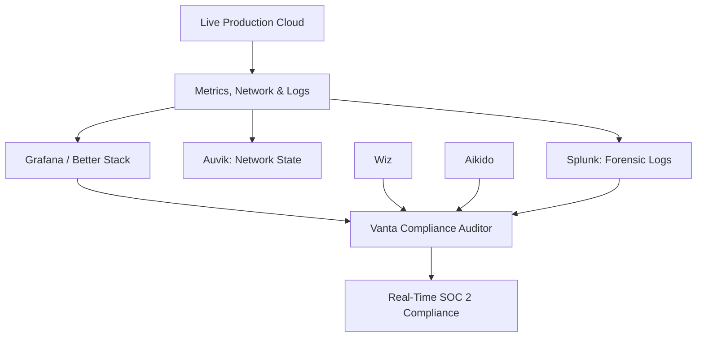
