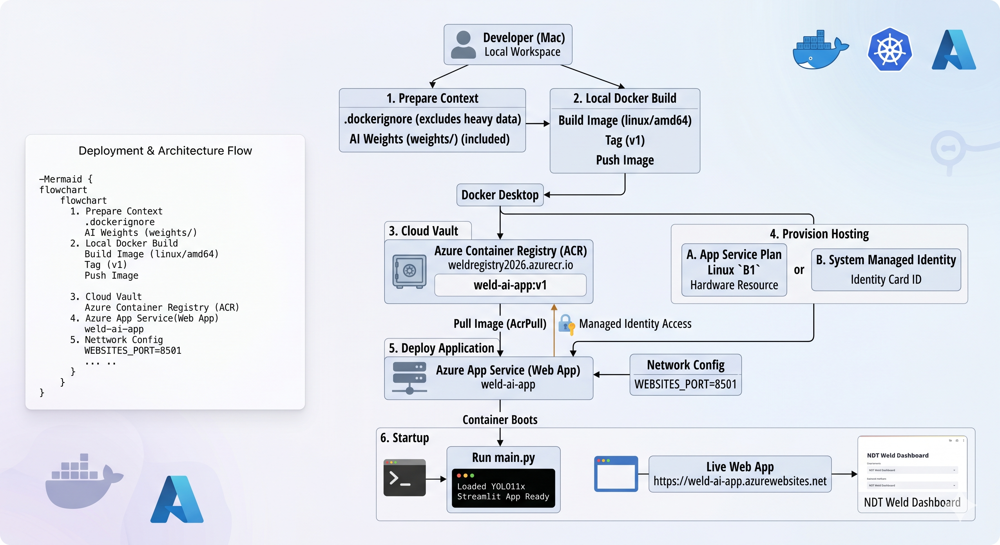

# Architecture Explanation: 

 

1. Build & Push (Local Mac)
This is where you are today. You use your Mac terminal and Docker Desktop to zip up the code, build a cross-platform container, tag it, and push it up to the cloud vault.

2. Storage Vault (Azure Registry)
The central "safe." This private vault stores your finished container image, protected by Azure's standard security layers.

3. Application Runtime (Web App)
This is the production environment. We enabled a Managed Identity on this app, which acts like a digital key. Because of the AcrPull permission we assigned, this identity opens the vault, pulls the container image, maps the 8501 port, and launches your NDT Dashboard live for your users in Canada Central.

