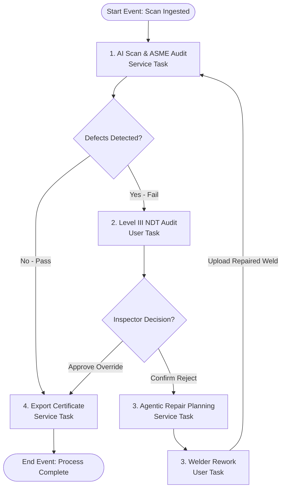
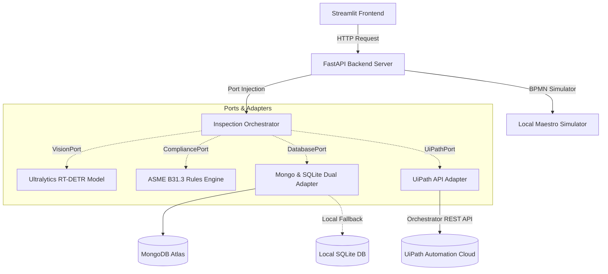

# UiPath Weld Agent — Autonomous NDT BPMN Inspector
**UiPath AgentHack 2026 Hackathon Submission (Track 2: UiPath Maestro BPMN)**

This repository contains an enterprise-grade autonomous quality inspection system for Non-Destructive Testing (NDT) radiography films, orchestrated end-to-end by **UiPath Maestro BPMN 2.0**.

The architecture follows a strict **Hexagonal Architecture (Ports and Adapters)** design pattern to isolate core business rules, computer vision inference, and repair planning agents from external interfaces, databases, and the UiPath Orchestrator API.

---

## 🤖 Solution Agent Type & Classification
This solution uses a **combination of coding agents and low-code orchestrators**:
*   **Coding Agents**: A reasoning agent powered by **Google Antigravity SDK** and the **Gemini 1.5 Pro API** manages compliance checking and creates custom, context-aware repair action plans based on ASME standard defects.
*   **Low-Code Process Orchestrator**: **UiPath Maestro BPMN 2.0** models and governs the overall business workflow, routing intermediate status updates, managing manual verification tasks, and handling retry loops.

## 🛠️ UiPath Components Used
*   **UiPath Maestro BPMN 2.0**: The core runtime engine driving the inspection lifecycle state machine.
*   **UiPath Studio**: Design-time environment containing the workflow model (`weld_inspection_bpmn_flow.xaml`).
*   **UiPath Orchestrator**: Governs queue ingestion (`Weld_Scan_Queue`), credentials assets (`GEMINI_API_KEY`), and storage buckets (`Weld_Radiographs`).
*   **UiPath Action Center**: Powers form tasks for Human-in-the-Loop review (Level III Compliance Audit Task and Welder Rework Order Task).

## 📋 Prerequisites
*   **Python**: Version 3.9, 3.10, or 3.11.
*   **Docker & Docker Compose**: Required for running via containers.
*   **Gemini API Key**: From Google AI Studio.
*   **UiPath Automation Cloud Tenant**: Required for live deployment (otherwise runs in simulation mode).

---

## BPMN 2.0 Process Flow

The inspection lifecycle follows a structured sequence of service tasks, user tasks, gateways, and loops modeled in UiPath Maestro BPMN:



---

## Decoupled Architecture

The application is split into a separate frontend client, backend API, and UiPath orchestration layer:



### Components
1. **Frontend (`frontend/app.py`)**: A Streamlit interface containing the standard Weld Analysis inspect tab and the dedicated **🤖 UiPath Maestro BPMN** control dashboard. It has **zero dependencies** on backend source code.
2. **Backend API (`src/api/server.py`)**: A FastAPI microservice serving the inspection endpoints, local BPMN state machine simulator, and repair technicians database.
3. **Core Orchestrator (`src/core/`)**: The Antigravity reasoning agent decoupled using abstract ports (`VisionPort`, `CompliancePort`, `DatabasePort`, `UiPathPort`).
4. **Repair Planning Agent (`src/core/use_cases/repair_planner.py`)**: A Gemini-powered agent that analyzes compliance failures, queries certified repair technicians, and designs custom Repair Action Plans.
5. **UiPath Adapter (`src/infrastructure/adapters/uipath_adapter.py`)**: Adapter supporting real Orchestrator OAuth REST endpoints and an automatic fallback to the local API simulator when offline.

---

## Getting Started

### Method 1: Docker Compose (Recommended)
You can start the frontend client, backend server, and SQLite failovers with a single command:
```bash
docker-compose up --build
```
* Streamlit Frontend: `http://localhost:8501`
* Backend API: `http://localhost:8000`

### Method 2: Manual Start (Local Development)

1. **Install Dependencies**:
   ```bash
   pip install -r requirements.txt
   ```

2. **Configure Environment**:
   Create a `.env` file in the root folder:
   ```env
   GEMINI_API_KEY=your_gemini_api_key_here
   API_URL=http://localhost:8000
   MONGODB_URI=mcp://mongodb.partner.local
   
   # Optional: Configure real UiPath Orchestrator credentials
   # UIPATH_CLIENT_ID=your_client_id
   # UIPATH_CLIENT_SECRET=your_client_secret
   # UIPATH_ORG_NAME=your_organization_name
   # UIPATH_TENANT_NAME=your_tenant_name
   # UIPATH_FOLDER_ID=your_folder_id
   ```
   *Note: If UIPATH credentials are left blank, the adapter automatically runs in local simulation mode.*

3. **Start FastAPI Backend**:
   ```bash
   PYTHONPATH=. uvicorn src.api.server:app --reload --port 8000
   ```

4. **Start Streamlit Frontend**:
   ```bash
   streamlit run frontend/app.py --server.port 8501
   ```

---

## Testing & Verification

Verify the codebase compiles, passes all Hexagonal Port validations, and simulates the BPMN process sequence:
```bash
PYTHONPATH=. pytest
```

---

## UiPath Assets

Deployable assets for the UiPath Automation Cloud can be found in the [uipath/](file:///Users/anjanid/projects/manufacturing/ai_weld_uipath/uipath) directory:
*   [uipath/README.md](file:///Users/anjanid/projects/manufacturing/ai_weld_uipath/uipath/README.md) — Detailed integration and assets setup guide.
*   [uipath/weld_inspection_bpmn_flow.xaml](file:///Users/anjanid/projects/manufacturing/ai_weld_uipath/uipath/weld_inspection_bpmn_flow.xaml) — Process workflow design template for import into UiPath Studio.

---

## License

This project is licensed under the [MIT License](LICENSE).
