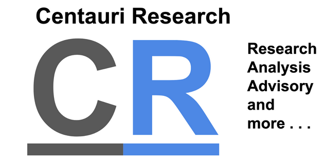

# Devpost Project Page: UiPath Weld Agent (Autonomous NDT BPMN Inspector)

This document contains all details formatted for a Devpost hackathon project submission. You can copy/paste this directly into your Devpost draft.

---

## 📌 Project Title
**UiPath Weld Agent — Autonomous NDT BPMN Inspector**

---

## 🏷️ Track Selection
*   **Track 2: UiPath Maestro BPMN** (Maestro Process Orchestration and State Machines)
*   **Alternative Subcategories**: AI/ML Agents, Industrial Automation, Intelligent Document/Image Processing.

---

## 💡 Elevator Pitch
An enterprise-grade autonomous Non-Destructive Testing (NDT) radiography film inspection system, governed end-to-end by **UiPath Maestro BPMN 2.0**. It combines computer vision (YOLO/RT-DETR) defect localization with Google Gemini-powered reasoning agents to draft compliant welding repair action plans (ASME B31.3) and manage automated and human-in-the-loop workflows.

---

## ❓ The Business Problem It Solves

Industrial piping, pipeline, and structural fabrication require strict compliance with construction standards (such as **ASME B31.3** and **API 1104**). In many industries, welds are evaluated using Non-Destructive Testing (NDT) via industrial radiography (X-ray films). Currently, this process suffers from:
1. **Manual Inspection Bottlenecks**: Certified Level III NDT inspectors are scarce and must manually review thousands of radiography films, creating major project delays.
2. **Human Fatigue & Subjectivity**: Subtle defects like Porosity, Slag Inclusion, or Lack of Fusion can easily be missed or mismeasured by fatigued inspectors, resulting in catastrophic pipeline failures.
3. **Inefficient Repair Loops**: When a weld fails, engineers must manually research standard codes, locate certified welders with appropriate process/material qualifications, draft a repair action plan, and manually track the rework loop.

Our solution automates the defect detection, standard compliance audit, technician allocation, and rework orchestration, cutting down processing times from days to minutes while eliminating human error.

---

## 🛠️ How It Works (Technical Flow)

The solution uses a **Hexagonal Ports & Adapters architecture** to decouple the core business logic from UI, databases, and third-party models:

1. **Scan Ingest & Contrast Optimization**: Radiography scans are uploaded or ingested via a UiPath Orchestrator Queue (`Weld_Scan_Queue`). The backend applies **CLAHE (Contrast Limited Adaptive Histogram Equalization)** to enhance contrast-sensitive weld defects.
2. **AI Computer Vision (RT-DETR/YOLO)**: The image is run through our custom fine-tuned object detection pipeline (implementing `VisionPort`) to localize defect types (porosity, slag, lack of fusion) and measure their dimensions.
3. **Compliance Code Audit**: The dimensions are cross-referenced dynamically against code rules (like ASME B31.3 or client-specific specification overrides) in our deterministic compliance engine.
4. **UiPath Maestro BPMN Governance**: If no defects violate the code rules, the state machine triggers the **Export Certificate Service Task** automatically. If defects are found:
   * A **Level III NDT User Audit** is dispatched to **UiPath Action Center** for human validation.
   * If rejected, the state machine invokes the **Agentic Repair Planning Service Task**.
5. **AI Repair Planning Agent**: A reasoning agent powered by **Google Gemini (via the Antigravity SDK)** queries our certified welders database, selects the optimal available technician based on material and process qualifications, and generates a step-by-step markdown repair action plan.
6. **Welder Rework Loop**: The rework order and action plan are dispatched to a technician via **Action Center**. Once reworked, a new scan is uploaded, restarting the cycle.

---

## 📷 Screenshots / Images in Action

Include the following visual layouts on your Devpost project profile:

1. **System Process Flow Diagram (BPMN 2.0)**:
   Include the process flow showing how Service Tasks, Gateways, User Handoffs, and Repair Loop actions are modeled:
    *(Use your custom BPMN flow chart/diagram here)*

2. **Streamlit Weld Analysis UI**:
   - **Inspect Tab**: Show the drag-and-drop file uploader, the CLAHE image processor, the annotated radiography film showing red bounding boxes around defects, and the detailed compliance pass/fail report cards.
   - **BPMN Control Center Dashboard**: Show the local simulator panel displaying real-time states (e.g. `STEP_SCAN_COMPLIANCE`, `STEP_NDT_HUMAN_AUDIT`, `STEP_REPAIR_PLANNING`), live variables, and a list of simulated Action Center forms.

3. **Orchestrator Logs & Audit Trails**:
   - Show the Mongo DB Atlas explorer containing collections for `audit_logs`, `compliance_standards`, and `technician_feedback`.

---

## 🚀 Accomplishments We're Proud Of
*   **Dual Database Adapter Resilience**: If MongoDB Atlas goes offline, the system seamlessly fails over to local SQLite storage without losing inspection states or logs.
*   **Strict Hexagonal Decoupling**: Frontend and Backend projects have **zero code dependencies** on each other, allowing independent deployment (e.g. streamlit on App Hosting, fastapi on cloud microservice).
*   **High Performance Cache**: Implemented a cryptographic hash tracker on images to instantly serve cached reports if an identical scan is re-uploaded.

---

## 📝 Project License
Licensed under the **MIT License**.
